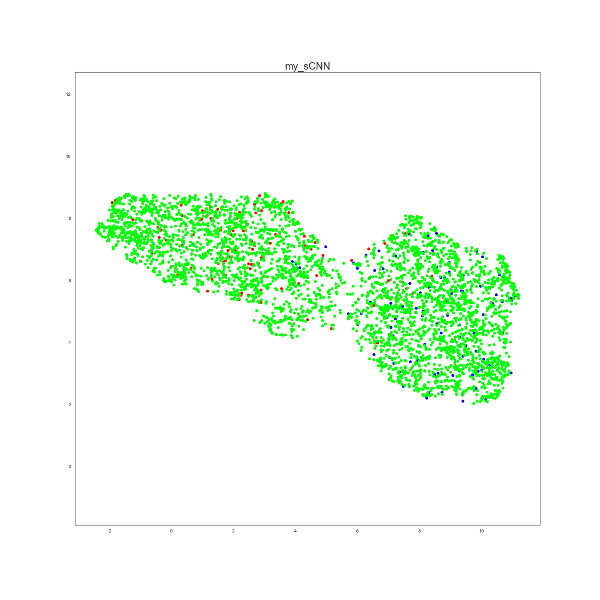

BYOL (Bootstrap Your Own Latent) was used for Eyes problem (opened\closed classification).
 | [Paper](https://arxiv.org/pdf/2006.07733.pdf) | [Paper Review](https://medium.com/swlh/neural-networks-intuitions-10-byol-paper-explanation-f8b1d6e83b1c) | [implementation used](https://github.com/lucidrains/byol-pytorch)

## Umap projection of embeddings
each dot is unique embedding for eye image from dataset. Red dots is opened eyes, blue - closed, and green - unknown.

## Results
Achieved accuracy is 88%

## Files
<b>Eye_task.ipynb</b> - Jupyter Notebook (training loop and etc.)
<b>Estimator.py</b> - Estimator class
<b>clusters.npy</b> - opened\closed eyes clusters
<b>traced_cnn.zip</b> PyTorch Jit Trace for trained NN
<b>sCNN_BYOL.pt</b> - NN weights
<b>task.txt</b> - task description